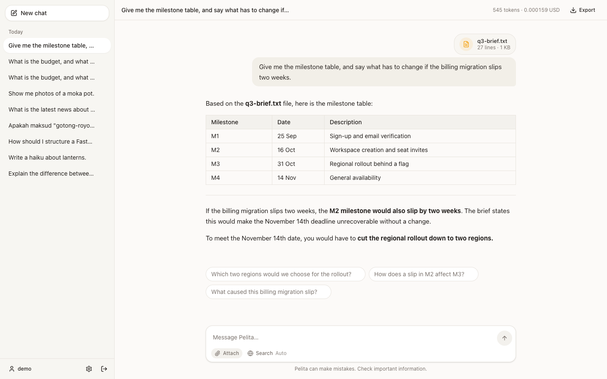

# Pelita

An open-source chatbot template. Point it at any OpenAI-compatible model and run
it with one command.

Switching from OpenAI to Groq, Ollama, OpenRouter or vLLM means editing three
lines of `.env`. No code change, no vendor SDK — nothing in this repository
imports `openai`, `anthropic` or anything like them.



## Quick start

```bash
git clone https://github.com/khaled-saiful-islam/pelita.git && cd pelita
cp .env.example .env          # then set LLM_API_KEY
make up
```

Open <http://localhost:8080> and sign in with **admin / admin**.

`make up` builds both images, waits for Postgres, runs migrations, seeds the
admin account and starts everything. There are no manual steps.

> **Change `SEED_ADMIN_PASSWORD` and `JWT_SECRET` before deploying anywhere.**
> The app refuses to start with the shipped defaults when `APP_ENV=production`.

## Configure a provider

Three variables. That is the whole switch.

| Provider | `LLM_BASE_URL` | `LLM_MODEL` |
|---|---|---|
| OpenAI | `https://api.openai.com/v1` | `gpt-4o-mini` |
| Groq | `https://api.groq.com/openai/v1` | `llama-3.3-70b-versatile` |
| Ollama | `http://localhost:11434/v1` | `llama3.2` |
| OpenRouter | `https://openrouter.ai/api/v1` | `anthropic/claude-3.5-sonnet` |
| vLLM | `http://localhost:8000/v1` | the model you serve |

Leave `LLM_API_KEY` empty for a local Ollama. Everything else has a working
default.

## Features

| | |
|---|---|
| **Streaming chat** | Token-by-token over SSE, with a stop button that cancels on the server and keeps the partial answer |
| **Web search** | Optional per message. Shows "Searching the web…" while it runs and lists numbered sources under the answer |
| **Tool calling** | The model picks its own tools and can run several in a turn — two questions, two searches. Falls back to pattern matching on providers without function calling |
| **Attached files** | Text, PDF and Word files — three per chat, 5 MB each. Each appears as a card on the message that sent it, and stays readable for the rest of the chat |
| **Image understanding** | Attach a photo, screenshot or scan and ask about it. Needs a vision model; off until you set `VISION_MODEL` |
| **News strip** | Headlines on the new-chat screen, pulled from an MCP server via the official Python SDK and cached for 30 minutes |
| **Token and cost accounting** | Per message and per conversation, labelled as provider-reported or estimated so a total is never quietly a guess |
| **Language auto-detection** | Replies in the language of your first message. Verified for Bahasa Melayu, English, Tamil, Chinese and Bengali |
| **Memory** | Facts that persist across conversations, added by you or extracted as you talk — all editable and deletable |
| **Follow-up suggestions** | Three chips after each answer |
| **Prompt-injection guard** | Scans your input *and* text from search and news before it reaches the prompt, with a banner naming what it found |
| **Accounts** | Sign-up, sign-in, profile, JWT in an httpOnly cookie |
| **Export** | Any conversation as Markdown |
| **Theme** | Light, dark, or follow the system |

## Commands

```
make up        build, migrate, seed, start, print the login
make down      stop, keep the database
make dev       hot reload on both sides
make logs      follow logs
make test      backend pytest with coverage, then frontend vitest
make lint      ruff and tsc
make migrate   apply pending migrations
make reset     destroy the database and start clean
```

`make test` and `make lint` run the frontend toolchain in a container, so Docker
is the only prerequisite.

## Common configuration

| Variable | Default | |
|---|---|---|
| `WEB_PORT` / `API_PORT` | `8080` / `8000` | Change if something else holds the port |
| `SERPAPI_KEY` | *(empty)* | Enables web search. The toggle stays disabled without it |
| `LLM_PRICE_INPUT_PER_1M` / `_OUTPUT_PER_1M` | `0.15` / `0.60` | **Set to your provider's real rates**, or the cost column is fiction |
| `DOCUMENT_MAX_BYTES` / `_MAX_PER_CONVERSATION` | `5 MB` / `3` | Attached-file limits. Raising the size means raising `client_max_body_size` in `frontend/nginx.conf` too |
| `VISION_MODEL` | *(empty)* | Enables image upload. `gpt-4o-mini`, `llama-3.2-11b-vision-preview`, `llava`. Defaults to the `LLM_` URL and key |
| `TOOL_MAX_ITERATIONS` | `3` | Rounds of tool calls per turn — the cost ceiling, since each is another model call |
| `SUPPORTED_LANGUAGES` | `en,ms,ta,zh,bn` | Languages to detect between |
| `MEMORY_AUTO_EXTRACT` | `true` | `false` removes one model call per turn |
| `SUGGESTIONS_ENABLED` | `true` | `false` removes one model call per turn |
| `MCP_NEWS_COUNTRY` | `US` | `MY` for Malaysia |

Every setting lives in [`.env.example`](.env.example) with a comment.

## Architecture

Three ideas make this a template rather than an app:

**Everything pluggable is a Protocol with a registry.** Providers, guards and
search backends are each one file plus one registry line. Nothing else imports a
concrete implementation.

**The prompt is built by ordered contributors.** System prompt at 100, memory at
200, tool results at 300, attached files at 350, history at 400, the user message
at 500. Document upload shipped as one contributor at the retrieval slot plus one
registry line, with no change to the chat turn — which is the claim, tested.

**Logic never imports FastAPI.** `services/`, `providers/`, `guards/`,
`context/` and `tools/` hold logic; `api/` holds HTTP. An AST test fails the
build if that drifts.

```
backend/app/
├── api/         HTTP only — routers, dependencies, schemas
├── services/    business logic
├── providers/   base.py (Protocol) + openai_compatible.py + registry.py
├── guards/      base.py (Protocol) + prompt_injection.py + registry.py
├── context/     the ordered contributor pipeline
├── tools/       serpapi.py, news_mcp.py
└── db/          models, repositories, session
frontend/src/styles/theme.css    every colour, in one file
```

## Documentation

Every feature has its own document covering what it does, how it works, its
configuration, how to extend it and its known limits:
[`docs/features/`](docs/features/).

Start with [001 — Provider adapter](docs/features/001-provider-adapter.md) and
[002 — Context pipeline](docs/features/002-context-pipeline.md); they explain
the two decisions everything else rests on.

## Tests

```
make test
```

576 backend tests and 44 frontend tests, 87% backend coverage. The
prompt-injection guard ships with both an attack corpus and a benign corpus —
the benign one matters more, because a guard that fires on "how do I ignore case
in a regex?" gets switched off, and a guard that is off catches nothing.

## Stack

FastAPI · Python 3.12 · SQLAlchemy 2.0 async · Alembic · Pydantic v2 ·
React · TypeScript · Vite · Tailwind · PostgreSQL 16 · Docker Compose

## Licence

MIT. See [LICENSE](LICENSE).
