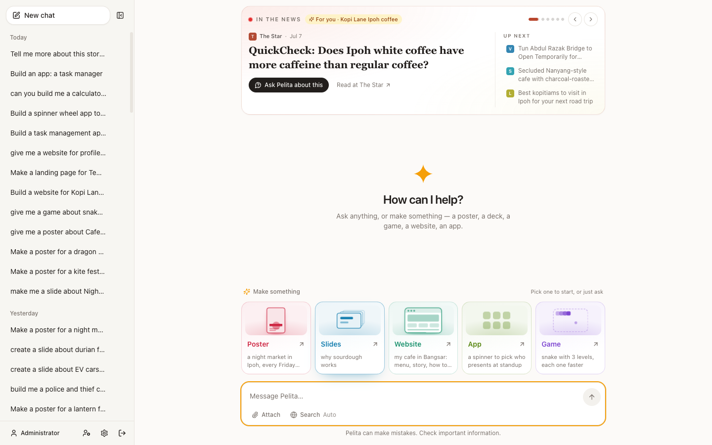
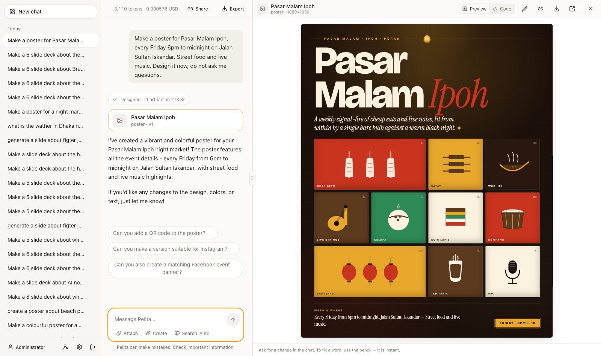
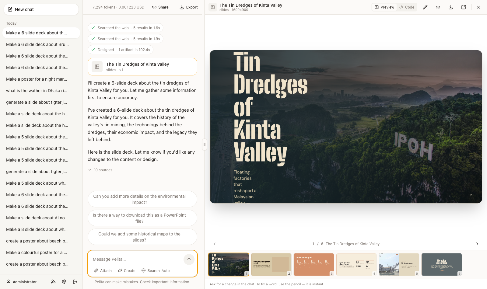
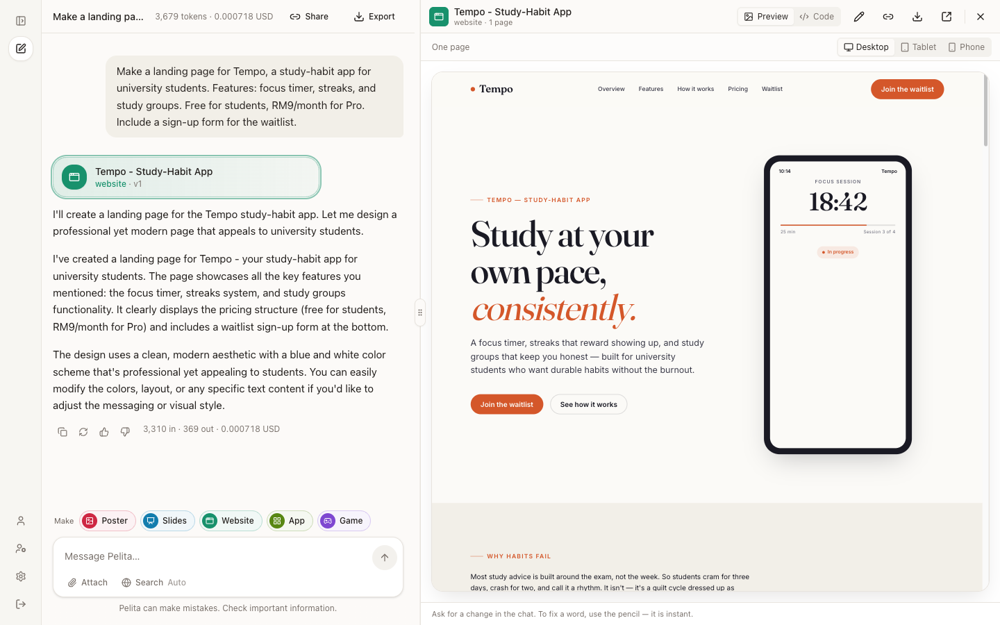
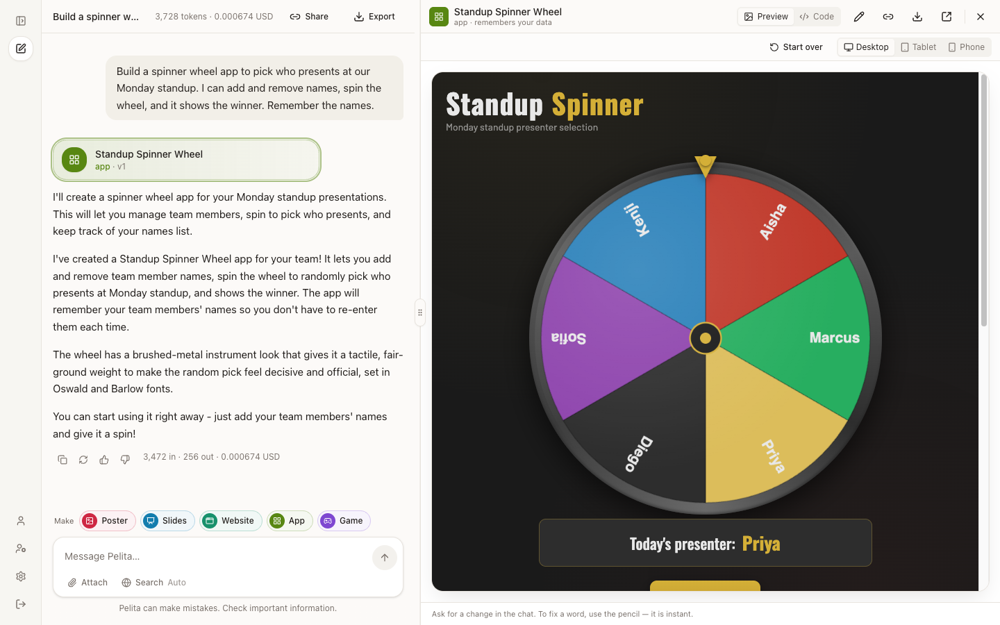
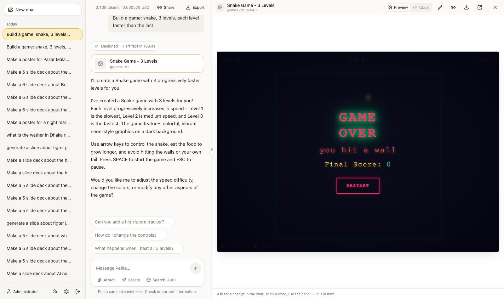
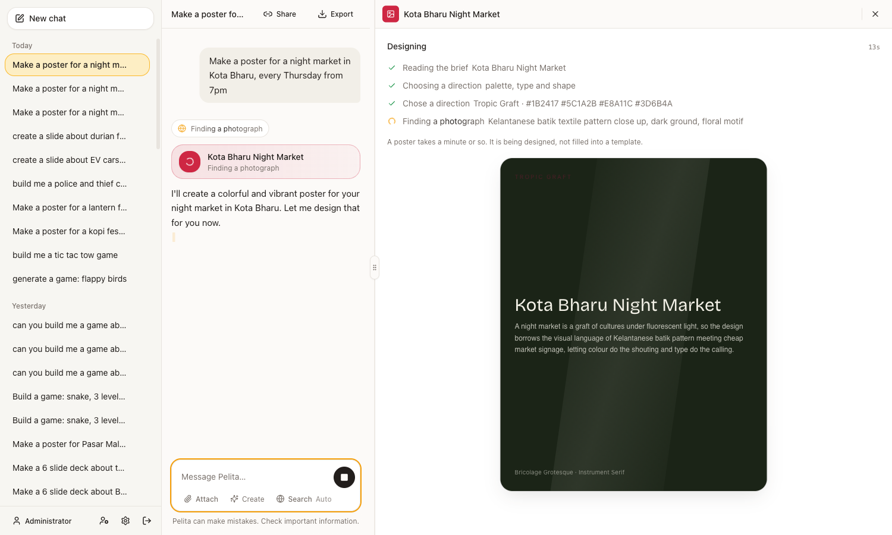

# Pelita

An open-source chatbot template. Point it at any OpenAI-compatible model and run
it with one command.

Switching from OpenAI to Groq, Ollama, OpenRouter or vLLM means editing three
lines of `.env`. No code change, no vendor SDK — nothing in this repository
imports `openai`, `anthropic` or anything like them.



Ask for a poster, a deck, a website, an app or a game and it is designed, not
filled into a template — its own palette, type and layout, chosen for the
subject, in a panel beside the conversation. The ones that run are used in a
real browser before you see them, and what broke goes back to the model to fix.

| | |
|---|---|
|  |  |
| **Poster** — a night market in Kota Bharu, with a photograph found for it | **Slides** — planned as a talk, on grounds the design named itself |
|  |  |
| **Website** — one page or several, on Desktop, Tablet or Phone | **App** — a standup spinner that remembers the team's names |
|  |  |
| **Game** — played in a browser before you saw it | **Being made** — what it is doing, and the look it has settled on |

Nothing is templated. The two decks below were asked for the same way, and the
design named its own grounds and picked its own faces for each subject:

| Deck | Grounds it invented | Faces |
|---|---|---|
| Highland coffee | canopy · mist · terracotta · harvest | Fraunces + DM Sans |
| KL Brutalism | concrete · ochre · terracotta · ink | Bricolage Grotesque + DM Sans |

While it works, the panel shows what it is doing and the look it has settled
on, glowing in its kind's colour — never the markup being written. Leave for
another chat and come back: it is still being made.

## Quick start

```bash
git clone https://github.com/khaled-saiful-islam/pelita.git && cd pelita
cp .env.example .env          # then set LLM_API_KEY
make up
```

Open <http://localhost:8080> and sign in with **admin / admin**.

`make up` builds both images, waits for Postgres, runs migrations, seeds the
admin account and starts everything. There are no manual steps.

> **Change `SEED_ADMIN_PASSWORD` and `JWT_SECRET` before deploying anywhere.**
> The app refuses to start with the shipped defaults when `APP_ENV=production`.

## Configure a provider

Three variables. That is the whole switch.

| Provider | `LLM_BASE_URL` | `LLM_MODEL` |
|---|---|---|
| OpenAI | `https://api.openai.com/v1` | `gpt-4o-mini` |
| Groq | `https://api.groq.com/openai/v1` | `llama-3.3-70b-versatile` |
| Ollama | `http://localhost:11434/v1` | `llama3.2` |
| OpenRouter | `https://openrouter.ai/api/v1` | `anthropic/claude-3.5-sonnet` |
| vLLM | `http://localhost:8000/v1` | the model you serve |

Leave `LLM_API_KEY` empty for a local Ollama. Everything else has a working
default.

## Features

| | |
|---|---|
| **Streaming chat** | Token-by-token over SSE, with a stop button that cancels on the server and keeps the partial answer |
| **Leave and come back** | A turn runs on the server, not in your tab. Switch chats or reload in the middle of a build and it is still going when you return, replayed from its first event |
| **Web search** | Knows today's date in your time zone, so "current" means now. Keeps Google's own answers and every result's date, opens the top pages to read the paragraph that answers, and tells the model newest-dated wins and to say what date it is from. Pushback is checked, not conceded. Numbered sources under the answer |
| **Tool calling** | The model picks its own tools and can run several in a turn — two questions, two searches. Falls back to pattern matching on providers without function calling |
| **Attached files** | Text, PDF and Word files — three per chat, 5 MB each. Each appears as a card on the message that sent it, and stays readable for the rest of the chat |
| **Image understanding** | Attach a photo, screenshot or scan and ask about it. Needs a vision model; off until you set `VISION_MODEL` |
| **News briefing** | Across the top of the new-chat screen: one story at a time in a card tinted by its source, the next three beside it, and **Ask Pelita about this** to turn a headline into a conversation. Pulled from an MCP server via the official Python SDK and cached for 30 minutes |
| **Token and cost accounting** | Per message and per conversation, labelled as provider-reported or estimated so a total is never quietly a guess |
| **Language auto-detection** | Replies in the language of your first message. Verified for Bahasa Melayu, English, Tamil, Chinese and Bengali |
| **Memory** | Facts that persist across conversations, added by you or extracted as you talk — all editable and deletable |
| **Follow-up suggestions** | Three chips after each answer |
| **Prompt-injection guard** | Scans your input *and* text from search and news before it reaches the prompt, with a banner naming what it found |
| **Accounts** | Sign-up, sign-in, profile, JWT in an httpOnly cookie |
| **Rate limiting** | Per-user caps on chat and uploads, per-address on sign-in. Counted in Postgres, so it survives more than one worker |
| **User management** | Admins create, disable and promote accounts, and cap what each one may spend per 24 hours. Unlimited by default |
| **Share links** | A public, read-only link to a conversation. A frozen copy, so later messages stay private; revocable, and never indexed |
| **Posters** | Ask for one and a poster is designed, not filled into a template — its own palette, type and layout, with photographs found on the web and embedded so the file stands alone. Opens in a panel beside the chat: share, open, download as PNG |
| **Slide decks** | A deck planned as a talk, then written one slide at a time so the first appears while the last is still being made. Five slides unless you say otherwise; it opens and closes like a talk; it moves between grounds it named itself for the subject; 16:9 enforced. Download as PDF |
| **Games** | A playable browser game, in one HTML file that opens anywhere. It is run in a real browser before you see it — keys pressed, console read — and what broke goes back to the model to fix. Keyboard *and* touch, pause, restart, and no network |
| **Websites** | A one-page landing page or a site of several pages — the plan decides from what you asked, unless you give a number. Its own design system, real photographs, and pages written separately so a five-page site does not trail off. Opened on a desktop and a phone before you see it, every page visited, and what breaks is fixed in the part it belongs to. In the panel: page tabs and Desktop / Tablet / Phone. Downloads as one HTML file with every page in it |
| **Apps** | A small web app you use — a calculator, a wheel of names, a task board, a budget, a timer. Designed first (what it does, what it keeps, the one detail that shows care), then *used* in a real browser before you see it: fields typed into, Enter pressed, every button pressed, at desktop and phone width. What it keeps — your tasks, your names — is saved on your account and there when you come back; a share-link visitor gets their own copy in their browser, never yours. Downloads as one HTML file |
| **Make something** | The five kinds sit right above the chat box as living tiles — each in its own colour with a tiny animated scene of what it makes and a real example to ask for. A light drifts from tile to tile; pick one and its example is written into the box with the subject selected, so you type your own or just press Enter. In a conversation they are a slim row of chips that steps aside while you type |
| **Watching one being made** | The panel shows the artifact forming: its real proportions, its real ground, its title in the face it just chose, and why it looks like that. A deck swaps it for real slides as they land. Never the markup being written |
| **Editing an artifact** | Ask in the chat box and only what you named changes — a colour change touches two lines of a 237 KB document, not the whole design. Fixing a word in place takes no model call and no new version |
| **Export** | Any conversation as Markdown |
| **Theme** | Light, dark, or follow the system |

## Commands

```
make up        build, migrate, seed, start, print the login
make down      stop, keep the database
make dev       hot reload on both sides
make logs      follow logs
make test      backend pytest with coverage, then frontend vitest
make lint      ruff and tsc
make migrate   apply pending migrations
make reset     destroy the database and start clean
```

`make test` and `make lint` run the frontend toolchain in a container, so Docker
is the only prerequisite.

## Common configuration

| Variable | Default | |
|---|---|---|
| `WEB_PORT` / `API_PORT` | `8080` / `8000` | Change if something else holds the port |
| `SERPAPI_KEY` | *(empty)* | Enables web search. The toggle stays disabled without it |
| `SEARCH_COUNTRY` | *(empty)* | Google country code, e.g. `MY`, for local prices, weather and news |
| `LLM_PRICE_INPUT_PER_1M` / `_OUTPUT_PER_1M` | `0.15` / `0.60` | **Set to your provider's real rates**, or the cost column is fiction |
| `DOCUMENT_MAX_BYTES` / `_MAX_PER_CONVERSATION` | `5 MB` / `3` | Attached-file limits. Raising the size means raising `client_max_body_size` in `frontend/nginx.conf` too |
| `VISION_MODEL` | *(empty)* | Enables image upload. `gpt-4o-mini`, `llama-3.2-11b-vision-preview`, `llava`. Defaults to the `LLM_` URL and key |
| `TOOL_MAX_ITERATIONS` | `3` | Rounds of tool calls per turn — the cost ceiling, since each is another model call |
| `RATE_LIMIT_CHAT_PER_MINUTE` | `20` | Messages per user. `TRUST_PROXY_HEADERS=false` if you expose the API without nginx |
| `PUBLIC_BASE_URL` | *(empty)* | **Set this to deploy.** Where share links point; empty builds them from the request |
| `SUPPORTED_LANGUAGES` | `en,ms,ta,zh,bn` | Languages to detect between |
| `MEMORY_AUTO_EXTRACT` | `true` | `false` removes one model call per turn |
| `SUGGESTIONS_ENABLED` | `true` | `false` removes one model call per turn |
| `MCP_NEWS_COUNTRY` | `US` | `MY` for Malaysia |

Every setting lives in [`.env.example`](.env.example) with a comment.

## Architecture

Three ideas make this a template rather than an app:

**Everything pluggable is a Protocol with a registry.** Providers, guards,
search backends and artifact kinds are each one file plus one registry line.
Nothing else imports a concrete implementation — slides shipped as
`slides.py` plus one line in `artifacts/registry.py`, games as `games.py`
plus one more, websites as `website.py` and apps as `web_app.py`, one line
each. The chat turn and the tool did not change to admit any of them. A game is
the first artifact that executes, a website the first that answers its own
forms, and an app the first that remembers: each privilege is one field on the
kind, and the memory one table.

**The prompt is built by ordered contributors.** System prompt at 100, memory at
200, tool results at 300, attached files at 350, history at 400, the user message
at 500. Document upload shipped as one contributor at the retrieval slot plus one
registry line, with no change to the chat turn — which is the claim, tested.

**Logic never imports FastAPI.** `services/`, `providers/`, `guards/`,
`context/` and `tools/` hold logic; `api/` holds HTTP. An AST test fails the
build if that drifts.

```
backend/app/
├── api/         HTTP only — routers, dependencies, schemas
├── services/    business logic
├── providers/   base.py (Protocol) + openai_compatible.py + registry.py
├── guards/      base.py (Protocol) + prompt_injection.py + registry.py
├── context/     the ordered contributor pipeline
├── tools/       serpapi.py, news_mcp.py, artifact.py
├── artifacts/   base.py (Protocol) + poster.py + slides.py + games.py + website.py + web_app.py + registry.py
└── db/          models, repositories, session
frontend/src/styles/theme.css    every colour, in one file
```

## Documentation

Every feature has its own document covering what it does, how it works, its
configuration, how to extend it and its known limits:
[`docs/features/`](docs/features/).

Start with [001 — Provider adapter](docs/features/001-provider-adapter.md) and
[002 — Context pipeline](docs/features/002-context-pipeline.md); they explain
the two decisions everything else rests on.

## Tests

```
make test
```

1177 backend tests and 117 frontend tests, 85% backend coverage. The
prompt-injection guard ships with both an attack corpus and a benign corpus —
the benign one matters more, because a guard that fires on "how do I ignore case
in a regex?" gets switched off, and a guard that is off catches nothing.

## Stack

FastAPI · Python 3.12 · SQLAlchemy 2.0 async · Alembic · Pydantic v2 ·
React · TypeScript · Vite · Tailwind · PostgreSQL 16 · Docker Compose

## Licence

MIT. See [LICENSE](LICENSE).
